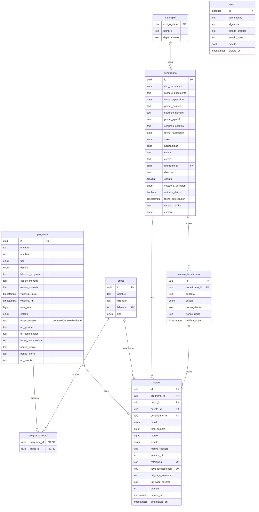

# Base de datos — propuesta

Esquema PostgreSQL para el flujo de subsidio (y el extra de bono) de las
[Historias de Usuario](../docs/Historias%20de%20Usuario%20—%20Bonos%20con%20Destino.md).
Es una **propuesta del rol de modelado de datos**: parte de las 6 tablas del diccionario
de las Historias y agrega lo que hacía falta para cuidar el dinero y la trazabilidad.

| Archivo | Qué hace |
|---|---|
| `001_esquema.sql` | Crea tipos, tablas, restricciones, índices, triggers y la vista de edad |
| `002_datos_prueba.sql` | Escenario ficticio de la demo: 4 personas, 1 punto, 3 cobros |

```bash
psql "$DATABASE_URL" -f db/001_esquema.sql
psql "$DATABASE_URL" -f db/002_datos_prueba.sql
```

Requiere PostgreSQL 13 o superior (usa `gen_random_uuid()` sin extensiones).
Cuando exista `api/`, `001_esquema.sql` pasa a ser `api/src/db/migraciones/001_init.sql`.

## Modelo



`evento` no tiene llaves foráneas: apunta a cualquier tabla con `tipo_entidad` + `id_entidad`.
La **liquidación** de la entidad no está aquí: se consulta, no se guarda.

## Qué protege la base (no la aplicación)

| Regla | Cómo |
|---|---|
| Nadie cobra dos veces (RN-02, HU-14) | Índice único parcial `(programa_id, beneficiario_id)` en Solicitado, PorConfirmar, Pagando y Pagado |
| Doble clic (HU-10) | `llave_idempotencia` única |
| Confirmación duplicada (HU-14) | `version` sube sola en cada cambio; la app actualiza con `WHERE id = $1 AND version = $2` |
| Estados coherentes | Trigger con la máquina de estados del cobro: rechaza saltos como Fallido → Pagado |
| Montos | Enteros (`bigint`) en unidades mínimas; positivos; el bono no supera la compra |
| Canal coherente | `cuenta` exige `cuenta_id` y no punto; `retiro`/`compra` exigen punto |
| Se paga a la cuenta correcta | FK compuesta: la cuenta del cobro es del mismo beneficiario |
| Historial intocable | `cobro` no admite DELETE; `evento` es solo inserción |
| Moneda fija | La billetera y la moneda del programa no cambian fuera de Borrador |

Probado en PostgreSQL 17: 15 violaciones bloqueadas y 10 inserciones simultáneas de la
misma persona → 1 solo cobro.

## Cambios frente al diccionario de las Historias

- **Nombres en español:** `wallet_address` → `billetera`, `asset_code`/`asset_scale` →
  `codigo_moneda`/`escala_moneda`, `access_token` → `token_acceso`, `idempotency_key` →
  `llave_idempotencia`, `incoming/outgoing_payment_url` → `url_pago_entrante/saliente`, etc.
- **`beneficiario` (nueva):** la persona, con los datos que entrega Colsubsidio. La cédula deja
  de ser llave primaria y `cobro` apunta a la persona por FK (también a quien no tiene cuenta).
- **`cuenta_beneficiario` con historial:** id propio; una sola cuenta vigente por persona.
- **`cobro.cuenta_id`:** guarda a qué cuenta exacta se pagó.
- **`municipio` (nueva):** catálogo DANE.
- **`referencia`** se genera sola (`SUB-0001`…). Puede tener saltos: una secuencia no se
  devuelve si la inserción falla, y eso es normal.
- **La edad no se guarda:** se calcula en la vista `beneficiario_con_edad`.

## Pendientes

1. **Fallido libera a la persona.** Solo se puede marcar `Fallido` con una respuesta
   definitiva del banco; un timeout deja el cobro en `Pagando` hasta reconciliar.
2. **Bloqueo de 15 min tras 3 PIN errados** (P-12): todavía no tiene tabla.
3. **Tokens en texto plano:** en producción, cifrados con KMS y en una tabla aparte.
4. **Finalidad de los datos personales** (estrato, edad, municipio para informes): confirmar
   con Colsubsidio que su política lo cubre; si no, separarlos en `beneficiario_perfil`.
5. Categorías de afiliación y si los menores (TI) cobran ellos o un acudiente.
